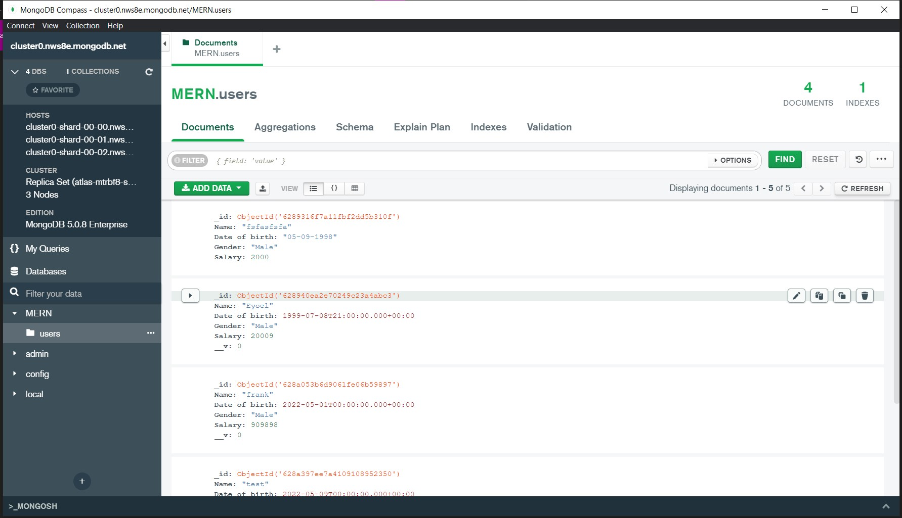
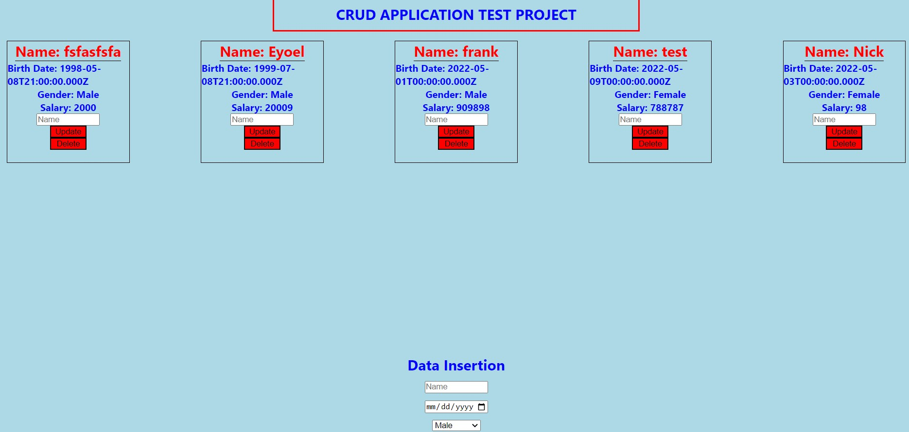
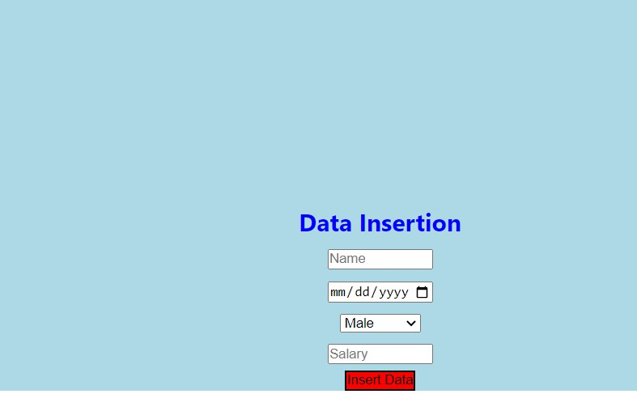
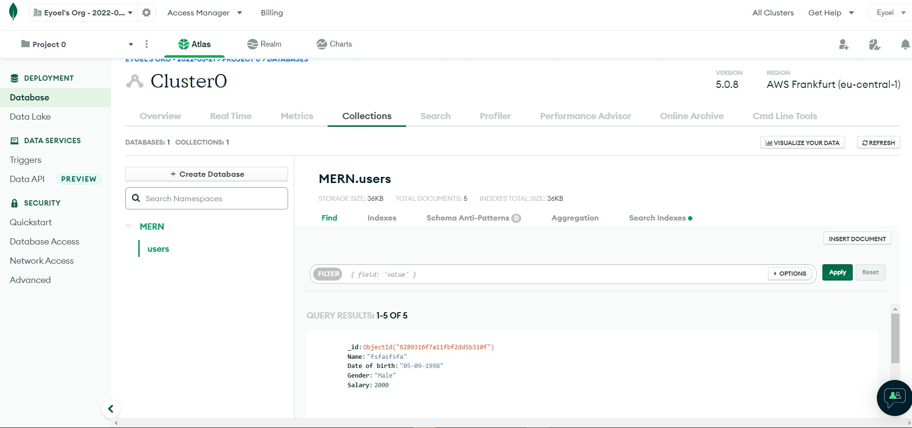

# project description

# simple mern stack

# LiveLink

- [https://628a7e8434ec3d096c1599ef--jovial-maamoul-f7138a.netlify.app/](https://jovial-maamoul-f7138a.netlify.app)

# technologies used

- MongoDB
- Express
- Cors
- ReactJs
- Axios
- Styled Components
- Redux
- Rest ApI
- PostMon
- typescript
- Mongoose
# Concepts Used
- Conditional rendering
- useEffect Hooks
- template string manipulation
- static typing
- Event Handlers
- CRUD operations

# How it works

## FrontEnd
React has been used as usual, using the map method we can render the lists that we have fetched using the restApi from the MongoDb server
## BackEnd
Mongoose and Express have been used to handle the backend, after setting up the MongoDb database using MongoDb official website and also with the help of MongoDB compass, we can handle each CRUD Operations

# Hosting
* Heroku - For Backend
* Netlify - For FrontEnd
# Results

